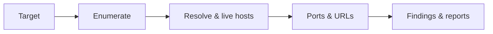

<p align="center">
  <br>
  <samp><b>O C U L U S</b></samp>
  <br><br>
  <sub><i>v4.1 · one lens. full surface.</i></sub>
  <br><br>
  <a href="#quick-start"></a>
  <a href="#expandable-guides"></a>
  <a href="#docker"></a>
  <a href="LICENSE"></a>
  
  <br><br>
</p>

---

**Oculus** is a single-file Python recon orchestrator for **Kali-style** workflows: it chains industry-standard CLI tools (ProjectDiscovery stack, `ffuf`, `nuclei`, `dalfox`, and more), adds **concurrency**, **session state**, **streaming output**, and ships **HTML / JSON / Markdown** reports—so you spend less time wiring shells and more time finding signal.

> **Heads-up:** Only point Oculus at systems you **own** or have **written permission** to test. This repo is for legal security research and authorized assessments.

---

## At a glance

| | |
|:---|:---|
| **Entry** | `python3 oculus.py` — interactive menu, or CLI flags below |
| **Config** | `~/.config/oculus/config.yaml` (copy from [`config.yaml.example`](config.yaml.example)) |
| **Output** | `output-<domain>/` — logs, text dumps, `session.json`, `findings.json`, `report.html`, `report.md` |
| **State** | `output-<domain>/session.json` (gitignored) — resume-friendly scans |
| **Guides** | **[Expandable guides](#expandable-guides)** — full config, CLI cookbook, outputs, playbooks |
| **Modules** | **[Module overview](#module-overview)** — always-visible cheat sheet (tools + what each step does) |
| **Web UI** | **[web/README.md](web/README.md)** — full real-time web interface to run Oculus from your browser |
| **Deep dive** | **[INSTALLATION.md](INSTALLATION.md)** (native / manual / Docker) · **[CHANGELOG.md](CHANGELOG.md)** |

---

## Run in Browser (New Web UI!)

Oculus v4.1 now features a complete, real-time web interface. You can configure scans, monitor live terminal output, and view generated reports directly in your browser without ever touching the CLI.

**Launch in Developer Mode (Standard / Live Reloading):**
```bash
# Terminal 1: Start Backend Daemon
cd web/backend && pip3 install -r requirements.txt --break-system-packages
python -m uvicorn server:app --host 127.0.0.1 --port 8000 --reload

# Terminal 2: Start Frontend Dev Server
cd web/frontend && npm install
npm run dev # Open http://localhost:5173
```

### ⚡ Tactical Control & High-End UX Highlights:
*   🟢 **Out-of-Band Heartbeat Monitor**: Sidebar integrates an asynchronous `3-second` non-blocking telemetry link to `/api/health`, utilizing custom breathing hardware-style keyframe glow animations to visually reflect real-time daemon state (`ONLINE` / `OFFLINE`).
*   🐉 **Operational Battle Presets**: Instant, single-click profile injection loaded with custom vector iconography (`🐉 Kali Linux Native` | `⚡ High Performance` | `🥷 Stealth Operations`), instantly re-mapping concurrency structures, timeouts, and target severities in real time.
*   🔄 **Zero-Latency Reset Core**: Instantly purges and re-syncs state configurations to pristine system baselines, eliminating static parameters via recursive async calls directly to the FastAPI config registry.
*   🛡️ **Accidental Abort Interception Layer**: Replaced fragile, instantly destructive termination calls with a threat-crimson modal warning engine. Leverages SVG `<ShieldAlert />` vector isolation, preventing accidental process interrupts on parallel scanning threads.
*   🎨 **Interactive Cyan Cyber-Glow Aesthetics**: The Jitter element has been elevated into a 100% clickable glassmorphic telemetry container. Uses fluid `0.3s` ease transitions, active micro-animations, glowing borders, active text shadows, and custom cyberpunk neon accents.
*   🏁 **Asynchronous Progress Fill Snapping**: Overrides raw mathematical state rendering, automatically force-snapping completed or resume-skipped processes (e.g. `29/29 modules`) straight to `100%` green visual completion bars the microsecond the daemon signals finalization.

*   🖼️ **Domain-Wise Screenshot Review**: Results and Reports include a Screenshots tab that groups captures by inferred domain/subdomain, supports both screenshot engines, and opens screenshots in a near full-screen viewer for readable triage.

See the **[Web README](web/README.md)** for full details.

---

## Quick start

**1.** Clone and install toolchains (Debian/Kali; needs **Go**, **Python 3.8+**, `sudo` for apt):

```bash
git clone https://github.com/shlokkokk/Oculus.git oculus && cd oculus
chmod +x install.sh && ./install.sh
# If Go is missing, the script will offer to install it for you.
```

**2.** Put `~/go/bin` on your `PATH`, then copy config:

```bash
echo 'export PATH="$PATH:$HOME/go/bin"' >> ~/.bashrc && source ~/.bashrc
mkdir -p ~/.config/oculus && cp config.yaml.example ~/.config/oculus/config.yaml
```

**3.** Run—pick **C** to set a domain, then **9** for full automated recon, **U** for the full spectrum scan, or use headless CLI:

```bash
python3 oculus.py -d example.com --full-recon --no-confirm
# Or run every module in one go:
python3 oculus.py -d example.com --full-spectrum --no-confirm
```

Put **Shodan** and **GitHub** tokens in `api_keys` for modules **28** and **26**. The sample YAML also lists **Chaos** for ProjectDiscovery-style workflows (Subfinder can use PD keys via your environment; the Python runner does not read `chaos` yet).

---

## Module overview

Use **menu #** in the TUI, or **`--module <name>`** headless (comma-separated). **9** / **`--full-recon`** runs **only** the core chain **1→8**. **D** / **`--deep`** runs a **fixed 14-step advanced chain** (not 1–9). **U** / **`--full-spectrum`** runs **every single module** across 5 phases with intelligent concurrency. See the comparison table below.

| # | CLI | Primary tools | What happens |
|:---:|:---|:---|:---|
| **1** | `subdomain` | Subfinder, Amass, Assetfinder | Enum subs from several sources, validate in-scope hostnames, dedupe → **`subdomains.txt`** |
| **2** | `dns` | dnsx | Resolve subs (A/AAAA/CNAME/NS/MX/etc.) with responses → **`dns_resolved.txt`** |
| **3** | `alive` | httpx, httprobe | Hit subs over HTTP(S) concurrently for dual-engine redundancy; JSON + raw formats merged → **`alive.txt`** |
| **4** | `ports` | dig, whois, Naabu / Nmap | Guess CDN from DNS/WHOIS; **Naabu** syn scan or **Nmap** fallback if CDN → **`ports_fast.txt`** |
| **5** | `fullports` | Nmap | All TCP ports **`-p-`**, scripts **`-sC`**, versions **`-sV`**, OS guess; dynamic timeout scales by alive-host count; parse XML → **`ports_full.txt`** |
| **6** | `urls` | Katana, gau, waybackurls | Crawl + passive archives in parallel, strip noise, dedupe → **`urls.txt`** / **`urls_final.txt`** |
| **7** | `waf` | wafw00f | One WAF probe per host (concurrent); normalize vendor names → **`waf_summary.txt`** |
| **8** | `vuln` | nuclei | Run templates on **`alive.txt`**; optional template update; JSONL + grouped text findings |
| **9** | `--full-recon` | *(steps 1→8)* | **Full auto recon:** runs the core pipeline then **summary + HTML + JSON** (not MD unless **R**) |
| **10** | `params` | ParamSpider, Arjun | Crawl/archival param mining + HTTP param brute from URL list → **`parameters/`** |
| **11** | `js` | LinkFinder, Python | Collect `.js` URLs; extract paths from JS; fetch + regex hunt for secrets → **`js_endpoints/`** |
| **12** | `fuzz` | ffuf | Recursive directory fuzz on first **10** alive hosts using YAML wordlist + extensions → **`fuzzing/`** |
| **13** | `api` | kr (Kiterunner) | API-style route discovery against alive hosts → **`api_fuzzing/`** |
| **14** | `takeover` | subzy, dig | Subzy takeover scan + parallel **CNAME** audit for dangling third-party records → **`takeover/`** |
| **15** | `hakrawler` | hakrawler | Crawl in-scope sites from **`alive.txt`**, merge new links into **`urls_final.txt`** |
| **16** | `screenshots` | gowitness + EyeWitness | Render every alive URL/domain/subdomain through both screenshot engines where available → **`screenshots/gowitness/`**, **`screenshots/eyewitness/`** |
| **17** | `dnsbrute` | massdns | Build `word.target` from DNS wordlist + resolvers; merge hits back into **`subdomains.txt`** |
| **18** | `gf` | gf | Classify **`urls_final.txt`** into buckets (xss, sqli, ssrf, lfi, redirect, rce) → **`gf/*.txt`** |
| **19** | `tech` | whatweb | Fingerprint stacks from **`alive.txt`** → **`tech_scan/`** JSON |
| **20** | `sqli` | sqlmap | Batch **sqlmap** over **`gf/sqli.txt`** (run **18** first if empty) → **`sqlmap/`** |
| **21** | `xss` | Dalfox | Feed **`gf/xss.txt`** to Dalfox; auto-runs **gf** if missing → **`xss_findings/`** |
| **22** | `cors` | Python | Send crafted **`Origin`** headers per host (concurrent); flag reflected / wildcard CORS → **`cors_findings/`** |
| **23** | `smuggling` | smuggler | Run smuggler per alive URL; merge anomalies → **`smuggling/`** |
| **24** | `asn` | asnmap | Map domain to ASN CIDR ranges for wider surface planning → **`asn/`** |
| **25** | `cloud` | Python | Probe guessed **S3 / GCS / Azure** style names from domain label → **`cloud/`** |
| **26** | `github` | GitHub API | Search indexed code for domain + secret-ish keywords (**token** in YAML) → **`github/`** |
| **27** | `osint` | theHarvester | Broad OSINT (`-b all`) → **`osint/`** HTML |
| **28** | `shodan` | Shodan API | Passive **hostname:** hits for exposed services (**API key** in YAML) → **`shodan/`** |
| **29** | `redirect` | Python | Fuzz redirect params from **`gf/redirect.txt`**; may auto-run **gf** first → **`redirects/`** |
| **D** | `--deep` | asnmap → ParamSpider/Arjun → … | **Fixed 14 steps only:** **24 → 10→11→12→13→14→15→16→18→19→21→22→23→20** (ASN first, **sqlmap** last). **Skips** menus **1–9**, **17**, **25–29**. Needs prior **`alive.txt`** / URLs from **9** or manual **1–8**+**6**. |
| **U** | `--full-spectrum` | *(all 29 modules)* | **Full Spectrum Scan:** runs every module across 5 phases (Discovery → Infrastructure → Content → Vulnerability → Exploitation) with concurrency where safe. Thread-safe, Ctrl+C graceful abort, session saves between phases. Auto-generates all reports. See **[Automation modes compared](#automation-modes-compared)**. |
| **R** | — | *(generators)* | Rebuild **`report.html`**, **`findings.json`**, **`report.md`** from disk artifacts |

---

## Automation modes compared

Oculus has three preset automation modes. Pick the one that matches your scope and time budget.

| | **[9] Full Auto Recon** | **[D] Deep Recon** | **[U] Full Spectrum Scan** |
|:---|:---|:---|:---|
| **Scope** | Core recon pipeline | Advanced modules only | Everything — recon through exploitation |
| **Modules run** | 7 (steps 1→8, skips 5) | 14 fixed advanced steps | All 29 modules |
| **Prerequisite** | Just set a domain | Needs `alive.txt` + URLs (run 9 first) | Just set a domain |
| **Concurrency** | Subdomain tools + URL tools in parallel | Sequential only | Full concurrent scheduling per phase |
| **Estimated time** | 15–45 min | 1–3 hours | 2–6 hours |
| **What it skips** | Advanced modules (10–29) | Core (1–9), DNS brute (17), Cloud/OSINT/Shodan/GitHub/Redirect (25–29) | Nothing — runs every module |
| **Reports** | HTML + JSON + summary | Summary only (run R for full) | HTML + JSON + Markdown + summary |
| **Ctrl+C safe** | Stops at current step | Stops at current step | Graceful abort, saves progress, still generates reports |
| **Thread safety** | Basic | Basic | Full `threading.Lock` protection |
| **Best for** | Quick initial assessment | Deep-dive after core recon | Overnight / hands-off full engagement |

### Full Spectrum Scan — 5-phase pipeline

```
PHASE 1: DISCOVERY
  [Sequential]  Subdomain Enum → DNS Bruteforce → DNS Resolution → Alive Hosts
  [Concurrent]  ASN + Cloud Assets + OSINT + Shodan + GitHub Dorking

PHASE 2: INFRASTRUCTURE
  [Concurrent]  Fast Port Scan + Full Port Scan + Tech Scan + WAF Detection + Screenshots

PHASE 3: CONTENT DISCOVERY
  [Sequential]  URL Collection → Advanced URL Enum
  [Concurrent]  Parameter Discovery + JS Endpoint Extraction
  [Sequential]  Subdomain Takeover Check

PHASE 4: VULNERABILITY ANALYSIS
  [Sequential]  Nuclei Vulnerability Scan → GF Filters
  [Concurrent]  Directory Fuzzing + API Fuzzing

PHASE 5: TARGETED EXPLOITATION
  [Concurrent]  SQLi Scan + XSS Scan + Open Redirect Scan
  [Concurrent]  CORS Scanner + HTTP Smuggling
```

---

## Expandable guides

Click a heading to open the full guide. Everything here matches [`oculus.py`](oculus.py) and [`config.yaml.example`](config.yaml.example).

<details>
<summary><b>Complete configuration reference</b> — load order, merge rules, every key, YAML examples, CLI interplay</summary>

### Where Oculus looks for YAML

Checked **in order**; the **first file that exists** is loaded (there is **no** merge across multiple paths):

| # | Path |
|:---:|:---|
| 1 | `~/.config/oculus/config.yaml` |
| 2 | `~/.config/oculus/config.yml` |
| 3 | `./config.yaml` (current working directory) |

**Implication:** If `~/.config/oculus/config.yaml` exists, a repo-local `./config.yaml` is **never** read. For per-project settings, use a dedicated clone without the global file, temporarily rename the global file, or symlink one file to another.

**PyYAML:** If `pyyaml` is not installed, YAML files are skipped and built-in defaults from `oculus.py` apply.

### How YAML merges with defaults

For each top-level key in your file:

- If the value is a **dict** and the key already exists in defaults (`wordlists`, `api_keys`, `nuclei`, `naabu`, `nmap`, `ffuf`), Oculus **shallow-merges** into that dict (`update()`).
- Otherwise the top-level key **replaces** the default value entirely.
- **Unknown** top-level keys are kept on the config object; most are ignored unless future code reads them.

### Every configuration key

| Key | Default (from code) | What uses it |
|:---|:---|:---|
| `threads` | `50` | **httpx** alive scan: `-threads` |
| `rate_limit` | `150` | **httpx** alive scan: `-rl` requests/sec |
| `timeout` | `300` | Loaded from YAML; **CLI `--timeout`** sets this key. **Caveat:** `run_command()` uses **`default_timeout`**, not `timeout`, so changing **`timeout` alone does not change** generic shell timeouts today — set **`default_timeout`** in YAML (or both to the same value). Most modules still pass **their own** timeouts. |
| `retry_count` | `2` | How many **retries** after a failed `run_command_with_retry` |
| `retry_delay` | `5` | Base seconds; actual wait is `retry_delay * (attempt + 1)` between retries |
| `parallel` | `true` | If `false`, subdomain enum and URL collection run tools **one after another** instead of `ThreadPoolExecutor` |
| `auto_confirm` | `false` | If `true`: skips **Nuclei `-ut`** prompt, **Deep recon** confirm, **session resume** prompt (same idea as `--no-confirm`) |
| `jitter` | `false` | If `true` (or `--jitter`): random **0.1–0.5s** sleep before each shell invocation |
| `default_timeout` | `300` | Shell `run_command` uses `config.get('default_timeout', 300)` when a step does not pass its own timeout. |
| `wordlists.dns` | SecLists path | **DNS bruteforce** (`dnsbrute`): wordlist for `word.mydomain` lines |
| `wordlists.dirs` | SecLists path | **ffuf** primary wordlist |
| `wordlists.dirs_fallback` | dirb path | Used if `dirs` path missing |
| `wordlists.resolvers` | massdns resolvers | **`massdns -r`** in DNS brute |
| `api_keys.github` | `""` | **Menu 26 / `--module github`** — GitHub Code Search API |
| `api_keys.shodan` | `""` | **Menu 28 / `--module shodan`** — Shodan host search |
| `api_keys.chaos` | `""` | **Not read by Python.** Optional: export ProjectDiscovery env vars for **Subfinder** etc. |
| `nuclei.severity` | `low,medium,high,critical` | Passed to **`-severity`** |
| `nuclei.rate_limit` | `150` | **`-rl`** |
| `nuclei.concurrency` | `25` | **`-c`** |
| `nuclei.templates` | `""` | If non-empty, adds **`-t <path>`** custom templates |
| `naabu.ports` | `1-65535` | **`-p`** for fast port scan (when not using Nmap fallback) |
| `naabu.rate` | `2000` | **`-rate`** packets/sec |
| `nmap.full_port_timeout_base` | `3600` | Minimum outer timeout for full-port Nmap (`fullports`) |
| `nmap.full_port_timeout_per_host` | `900` | Per-target scaling for full-port Nmap; budget is `max(base, alive_targets * per_host)` |
| `nmap.full_port_timeout_max` | `43200` | Hard cap for full-port Nmap timeout |
| `ffuf.extensions` | `php,html,...` | **`-e`** extension list for directory fuzz |
| `ffuf.status_filter` | `200,204,...` | **`-mc`** match codes |
| `ffuf.recursion_depth` | `2` | **`-recursion-depth`** |

### CLI flags that override config

| Flag | Effect on config |
|:---|:---|
| `--no-confirm` | Sets `auto_confirm` to `true` |
| `--threads N` | Sets `threads` to `N` |
| `--timeout N` | Sets `timeout` to `N` (see note on `default_timeout` above) |
| `--jitter` | Sets `jitter` to `true` |

### Example: stealth / polite

```yaml
threads: 20
rate_limit: 40
parallel: false
jitter: true
retry_count: 3
retry_delay: 8
naabu:
  ports: "1-1024"
  rate: 400
nuclei:
  severity: medium,high,critical
  rate_limit: 50
  concurrency: 10
```

### Example: automation / CI

```yaml
auto_confirm: true
parallel: true
jitter: false
retry_count: 1
api_keys:
  github: "ghp_xxxxxxxx"   # only if you run github module
  shodan: "xxxxxxxx"      # only if you run shodan module
```

Pair with: `python3 oculus.py -d target.com --full-recon --no-confirm`

### Example: aggressive internal lab (narrow ports, high templates)

```yaml
naabu:
  ports: "1-65535"
  rate: 4000
nuclei:
  severity: critical,high
  concurrency: 40
ffuf:
  recursion_depth: 3
  status_filter: "200,204,301,302,307,308,401,403,405,500"
```

### Example: custom wordlists + Nuclei template pack

```yaml
wordlists:
  dns: /opt/wordlists/dns-big.txt
  dirs: /opt/wordlists/web-combined.txt
  dirs_fallback: /usr/share/dirb/wordlists/common.txt
  resolvers: /opt/recontools/massdns/resolvers.txt
nuclei:
  templates: /root/nuclei-templates/my-program
  severity: high,critical
```

### Example: project-local file (only works if global config absent)

```bash
cd /path/to/Oculus
cp config.yaml.example ./config.yaml
# edit ./config.yaml — used only if ~/.config/oculus/config.yaml does NOT exist
```

### 🔑 Elevating Oculus to Top-Tier Reconnaissance: API Keys Master Guide

Without API keys, scanning tools are restricted to basic active probes and slow brute-forcing. Chaining passive threat intelligence sources turns your subdomain enumeration from **0 findings** to **thousands of hidden, high-value targets** in seconds. 

Follow this definitive guide to unlock the ultimate capabilities of the Oculus pipeline:

---

#### 🌐 1. Shodan API Key (Passive Host & Port Intel)
*   **Why it's critical:** Module **28** (`shodan`) performs zero-traffic port/host discoveries for your targets. It also enables Subfinder to pull historical DNS records.
*   **How to get it:**
    1.  Create an account at [shodan.io](https://www.shodan.io/).
    2.  Once logged in, navigate to [account.shodan.io](https://account.shodan.io/).
    3.  Copy the **API Key** shown on the top-right card.
*   **Where to paste:** Add it to your global config (`~/.config/oculus/config.yaml`):
    ```yaml
    api_keys:
      shodan: "YOUR_SHODAN_API_KEY"
    ```

---

#### 🐙 2. GitHub Personal Access Token (Leaked Secrets Hunt)
*   **Why it's critical:** Module **26** (`github`) crawls active GitHub repos searching for leaked secrets, sensitive variables, or undocumented target endpoints matching your target's domain.
*   **How to get it:**
    1.  Go to [github.com/settings/tokens](https://github.com/settings/tokens).
    2.  Click **Generate new token** ➡️ Select **Generate new token (classic)**.
    3.  Set a descriptive note (e.g. `Oculus Recon Pipeline`) and an expiration date.
    4.  Select the **`repo`** checkbox (for private repositories) or **`public_repo`** (for public repos only).
    5.  Click **Generate token** and copy it immediately.
*   **Where to paste:** Add it to your global config (`~/.config/oculus/config.yaml`):
    ```yaml
    api_keys:
      github: "YOUR_GITHUB_TOKEN_HERE"
    ```

---

#### ⚡ 3. ProjectDiscovery Chaos API Key (Pre-computed Subdomain Index)
*   **Why it's critical:** Chaos maintains a massive, real-time repository of pre-computed subdomains for public bug bounty programs. It enables instant subdomains retrieval without launching local wordlist scans.
*   **How to get it:**
    1.  Go to [chaos.projectdiscovery.io](https://chaos.projectdiscovery.io/).
    2.  Sign up or log in, then click **Request Access** to obtain an API key.
*   **Where to paste:** Paste it into your Oculus config and also export it to your environment variables:
    ```bash
    export CHAOS_API_KEY="YOUR_CHAOS_API_KEY"
    ```

---

#### 🐉 4. Subfinder Passive API Provider Config (Solving "Found 0 subdomains")
If your `subdomain` modules are returning few or zero subdomains, it is because Subfinder has no passive intelligence APIs configured in its central provider configuration.

To configure Subfinder APIs:
1.  On your Linux/Kali server, open or create the Subfinder config file:
    *   **Path:** `/home/shlok/.config/subfinder/provider-config.yaml` (or `~/.config/subfinder/provider-config.yaml`)
2.  Obtain free/freemium keys from the heavy-hitting intelligence sources below:
    *   **VirusTotal API Key:** Create a free account at [virustotal.com](https://www.virustotal.com/) and copy the API key from your profile dropdown.
    *   **SecurityTrails API Key (Highly Recommended):** Register a free developer account at [securitytrails.com](https://securitytrails.com/) for gold-standard DNS histories.
    *   **Censys API Key:** Create a free researcher account at [censys.io](https://censys.io/) to fetch subdomains parsed from millions of SSL certificates.
    *   **BinaryEdge API Key:** Register a free tier account at [binaryedge.io](https://www.binaryedge.io/).
    *   **Intelx API Key:** Register at [intelx.io](https://intelx.io/) to search historical dump databases.
3.  Write your keys into `~/.config/subfinder/provider-config.yaml` in this exact YAML format:

```yaml
# ~/.config/subfinder/provider-config.yaml
binaryedge:
  - "your_binaryedge_api_key"
censys:
  - "your_censys_api_id:your_censys_api_secret"
chaos:
  - "your_chaos_api_key"
github:
  - "your_github_token"
intelx:
  - "your_intelx_api_key"
securitytrails:
  - "your_securitytrails_api_key"
shodan:
  - "your_shodan_api_key"
virustotal:
  - "your_virustotal_api_key"
```

Once configured, Subfinder will automatically load these providers during Step 1 of the Oculus pipeline, immediately multiplying subdomain discovery yields by **10x to 100x**!

---

### Full starter YAML (identical to [`config.yaml.example`](config.yaml.example))

```yaml
# Oculus v4 Configuration File
# Copy to ~/.config/oculus/config.yaml

# General settings
threads: 50
timeout: 300
rate_limit: 150
retry_count: 2
retry_delay: 5
# Default timeout used by generic shell-invocations when a module doesn't pass its own timeout
default_timeout: 300
parallel: true        # Run independent tools concurrently
auto_confirm: false   # Skip confirmation prompts (useful for automation)
jitter: false         # Add random delays between tool calls for stealth

# Wordlist paths
wordlists:
  dns: /usr/share/wordlists/seclists/Discovery/DNS/subdomains-top1million-5000.txt
  dirs: /usr/share/wordlists/seclists/Discovery/Web-Content/common.txt
  dirs_fallback: /usr/share/wordlists/dirb/common.txt
  resolvers: /opt/recontools/massdns/resolvers.txt

# API Keys (optional — enables passive recon)
api_keys:
  shodan: ""
  github: ""
  chaos: ""

# Nuclei configuration
nuclei:
  severity: low,medium,high,critical
  rate_limit: 150
  concurrency: 25
  templates: ""   # Custom template path (leave empty for defaults)

# Naabu port scanner
naabu:
  ports: "1-65535"
  rate: 2000

# Nmap full-port scan timeout scaling
nmap:
  full_port_timeout_base: 3600       # Minimum budget: 1 hour
  full_port_timeout_per_host: 900    # Add 15 minutes per target
  full_port_timeout_max: 43200       # Hard cap: 12 hours

# FFUF directory fuzzing
ffuf:
  extensions: php,html,js,json,txt,bak,old
  status_filter: "200,204,301,302,307,401,403"
  recursion_depth: 2
```

</details>

<details>
<summary><b>CLI cookbook</b> — copy-paste recipes</summary>

```bash
# Interactive TUI (menu)
python3 oculus.py

# Full core pipeline + all confirmations skipped
python3 oculus.py -d example.com --full-recon --no-confirm

# Deep mode = fixed 14 advanced steps (NOT menus 1–9). Run full recon first so alive.txt / URLs exist.
python3 oculus.py -d example.com --deep --no-confirm

# Full Spectrum Scan = ALL 29 modules in 5 phases with concurrency. Set it and forget it.
python3 oculus.py -d example.com --full-spectrum --no-confirm

# Pick modules à la carte (order runs left → right)
python3 oculus.py -d example.com --module subdomain,dns,alive,urls,waf --no-confirm

# Lighter port pass + vuln only after alive
python3 oculus.py -d example.com --module subdomain,dns,alive,ports,vuln --no-confirm

# Passive / API-heavy day (keys in ~/.config/oculus/config.yaml)
python3 oculus.py -d example.com --module shodan,github,osint --no-confirm

# High parallelism from CLI (overrides YAML)
python3 oculus.py -d example.com --module alive --threads 80 --no-confirm

# Stealthy spacing between shell tools
python3 oculus.py -d example.com --module subdomain,alive --jitter

# Update repo + toolchain from clone root
python3 oculus.py --update
```

**Interactive workflow:** run without `-d` → **C** set domain → **I** verify tools → **9** (core) or **U** (full spectrum) or pick numbers → **R** export HTML/JSON/MD.

</details>

<details>
<summary><b>Outputs, sessions, and logs</b> — layout and filenames</summary>

All scan data goes under **`output-<domain>/`** (created when you set the domain).

| Path | Role |
|:---|:---|
| `logs/oculus.log` | Detailed run log |
| `logs/errors.log` | ERROR-level only |
| `session.json` | Resume metadata: `results`, `completed_modules`, timestamp |
| `subdomains.txt` | Deduped in-scope hostnames |
| `alive.txt` | **httpx** URLs (scheme included) |
| `urls.txt` / `urls_final.txt` | Merged URL corpus |
| `nuclei_output.jsonl` / `.txt` | Machine + human-readable vulns |
| `summary.txt` | Text executive summary |
| `report.html` / `findings.json` / `report.md` | Generated from menu **R** (and partial set after **full recon**) |

Subfolders (created as needed): `parameters/`, `js_endpoints/`, `fuzzing/`, `api_fuzzing/`, `takeover/`, `screenshots/gowitness/`, `screenshots/eyewitness/`, `gf/`, `tech_scan/`, `sqlmap/`, `xss_findings/`, `cors_findings/`, `smuggling/`, `asn/`, `cloud/`, `github/`, `osint/`, `shodan/`, `redirects/`, etc.

**Session resume:** If `session.json` exists and you re-enter the same domain (**C**), Oculus restores prior `results`.
- **Full Spectrum (`U`)** offers a smart **Resume** mode: it skips already-completed steps (printing `[SKIP]`) to safely pick up where a long scan dropped off.
- **Full Auto (`9`)** and **Deep Recon (`D`)** will warn you about existing data and ask for confirmation before overwriting it.
- If `--no-confirm` / `auto_confirm` is set, `[U]` automatically resumes, while `[9]` and `[D]` automatically overwrite.

</details>

<details>
<summary><b>Playbooks</b> — Docker env, first-time checklist, Subfinder providers</summary>

**Docker + API keys without baking secrets into the image**

```bash
docker build -t oculus .
docker run --rm -it \
  -v "$(pwd):/app" \
  -e CHAOS_API_KEY="optional_chaos_key" \
  oculus -d target.com --module shodan,github --no-confirm
```

Mount a `config.yaml` into `~/.config/oculus/` inside the container instead if you prefer files over env.

**First-time checklist**

1. `./install.sh` (or Docker build)  
2. `export PATH="$PATH:$HOME/go/bin"`  
3. Copy [`config.yaml.example`](config.yaml.example) → `~/.config/oculus/config.yaml`  
4. Install **SecLists** (or point `wordlists` to your paths)  
5. Menu **I** until critical tools show ✔  

**GF → chained attacks:** run **`gf`** (or **`xss`/`sqli`/`redirect`** which auto-run GF) before **Dalfox**, **sqlmap**, or **open redirect** modules.

</details>

---

## Feature catalog

Everything below is implemented in [`oculus.py`](oculus.py) today. Open the sections you need.

<details>
<summary><b>Engine, preset pipelines, and reporting</b> — behavior, automation chains, artifacts</summary>

### Engine and operator experience

| Capability | What it does |
|:---|:---|
| **Concurrency** | `ThreadPoolExecutor` across subdomain tools, URL sources, WAF checks, JS fetches, CNAME takeover checks, cloud probes, open-redirect checks, and more |
| **Streaming commands** | Long-running tools stream lines to the terminal (with sampling so output stays readable) |
| **Retries** | `run_command_with_retry` honors `retry_count` / `retry_delay` from config |
| **Jitter** | Optional random delay before each shell invocation (`--jitter` or `jitter: true` in YAML) |
| **Parallel toggle** | `parallel: false` runs some multi-tool stages sequentially |
| **Health check** | On startup: free disk space warning, outbound connectivity probe |
| **Tool inventory** | Menu **I** — checks Go/apt tools plus `/opt/recontools` scripts (`paramspider`, `arjun`, `xsstrike`, `smuggler`, `linkfinder`, `subzy`, `kr`, `eyewitness`, `chromium`) and prints install hints |
| **Domain setup** | Menu **C** — validates domain format, creates `output-<domain>/` and `logs/` |
| **Host selection** | `_get_hosts()` prefers `alive.txt`, then `subdomains.txt`, then apex; enforces hostname contains target domain |
| **Session state** | `output-<domain>/session.json` stores metrics + completed module keys; optional resume on next run; **show_diff** after preset pipelines compares new vs restored counts |
| **Next-step hints** | After subdomains, DNS, alive, ports, URLs, or WAF, prints suggested menu options |
| **Logging** | `output-<domain>/logs/oculus.log` (debug) and `errors.log` (errors only) |
| **Rich UI** | Optional **rich** panels, tables, and banner; graceful ANSI fallback if `rich` is not installed |
| **Self-update** | `--update` runs `git pull` and `sudo ./install.sh --update` from the repo root |
| **Auto-Healing Resolvers** | If standard massdns resolvers files are missing, dynamically generates a colossal list of **120+ un-nerfed, highly responsive global recursive DNS resolvers** (representing 31 premium carriers) on the fly in `output-<domain>/auto_resolvers.txt` to guarantee unthrottled concurrent DNS brute-forcing! |

### Preset pipelines

**Full automated recon** (`--full-recon` / menu **9**), in order:

1. Subdomain enumeration → 2. DNS resolution (`dnsx`) → 3. Alive probe (`httpx` JSON) → 4. Fast port scan → 5. URL collection → 6. WAF detection → 7. Nuclei scan  

Then: **session diff**, **`summary.txt`**, **`report.html`**, **`findings.json`**. (Add **`report.md`** via menu **R** if you want Markdown too.)

**Deep recon mode** (`--deep` / menu **D**) — **not** “all modules,” **not** menus **1–9**:

Runs **exactly** this fixed sequence (same as `run_deep_recon_mode` in code): **24** ASN → **10** params → **11** JS → **12** ffuf → **13** kr → **14** takeover → **15** hakrawler → **16** screenshots (gowitness + EyeWitness when installed) → **18** gf → **19** whatweb → **21** dalfox → **22** CORS → **23** smuggling → **20** sqlmap.

**Does not run:** core **1–8** (subdomain, DNS, alive, ports, URLs, WAF, nuclei), **9**, **17** dnsbrute, **25** cloud, **26** github, **27** osint, **28** shodan, **29** redirect.

**Prerequisite:** you usually want **`alive.txt`** and URL data first — e.g. run **`--full-recon`** or at least **1→8** (and **6** for URLs) before **`--deep`**, otherwise several deep steps may no-op or fail on missing files.

Then: **session diff** + **`summary.txt`** only — run **R** for HTML / JSON / Markdown exports.

**Full Spectrum Scan** (`--full-spectrum` / menu **U**) — **every module, optimal order:**

Runs all 29 modules across 5 phases with intelligent concurrency. See **[Automation modes compared](#automation-modes-compared)** for the full pipeline diagram. Thread-safe tracking, graceful Ctrl+C abort (saves progress and still generates reports), and session checkpoints between every phase.

**No prerequisite:** Just set a domain. Full Spectrum handles the entire dependency chain from subdomain enumeration through targeted exploitation. Auto-generates HTML, JSON, and Markdown reports at completion.

### Reporting (menu **R**)

| Artifact | Contents |
|:---|:---|
| **`summary.txt`** | Domain, paths, discovery metrics, WAF ratio, vuln counts by severity, GF hit counts, full tool ✓/✘ matrix |
| **`report.html`** | Dark theme, **Chart.js** severity chart, **sortable** Nuclei table, collapsible lists (subs, alive, ports, URLs, params), recursive screenshot gallery linking images from both screenshot engines |
| **`findings.json`** | `domain`, `version`, `scan_date`, `results`, host/URL lists, parsed **`nuclei_output.jsonl`** |
| **`report.md`** | Compact Markdown aimed at **HackerOne-style** submissions |

</details>

<details>
<summary><b>Full scan module matrix</b> — CLI name, menu #, tools, main outputs</summary>

| Module | # | What runs |
|:---|:---:|:---|
| `subdomain` | 1 | **Subfinder** (`-all -recursive`), **Amass** passive, **assetfinder** — merge, validate, dedupe → `subdomains.txt` |
| `dns` | 2 | **dnsx** A/AAAA/CNAME/NS/PTR/MX/SOA on subdomain list |
| `alive` | 3 | **httpx** (JSON stats) + **httprobe** (lightweight fail-safe) in parallel → deduped `alive.txt` |
| `ports` | 4 | **CDN hint** via dig+whois; **Naabu** (or **Nmap** if CDN) — configurable port range/rate → `ports_fast.txt` |
| `fullports` | 5 | **Nmap** all ports **`-p-`** with **`-sV -sC -O`**, host-count-scaled timeout, XML parse → `ports_full.txt` (+ `.xml` / `.gnmap` base) |
| `urls` | 6 | **Katana**, **gau**, **waybackurls** in parallel → cleaned `urls.txt` + merged **`urls_final.txt`** |
| `waf` | 7 | Concurrent **wafw00f** per host → `waf_summary.txt` |
| `vuln` | 8 | **Nuclei** JSONL + **`nuclei_output.txt`**; optional **`-ut`** template update |
| `params` | 10 | **ParamSpider** + **Arjun** → `parameters/parameters_final.txt` |
| `js` | 11 | **LinkFinder** + concurrent JS fetch + **secret** regexes → `js_endpoints/` |
| `fuzz` | 12 | **ffuf** (max 10 hosts) → `fuzzing/` |
| `api` | 13 | **kr** (Kiterunner) → `api_fuzzing/kr_results.txt` |
| `takeover` | 14 | **subzy** + **dig** CNAME workers → `takeover/` |
| `hakrawler` | 15 | **hakrawler** → merges **`urls_final.txt`** |
| `screenshots` | 16 | **gowitness** + **EyeWitness** where installed → `screenshots/gowitness/`, `screenshots/eyewitness/` |
| `dnsbrute` | 17 | **massdns** + wordlist → merges into `subdomains.txt` |
| `gf` | 18 | **gf** `xss` `sqli` `ssrf` `lfi` `redirect` `rce` → `gf/*.txt` |
| `tech` | 19 | **WhatWeb** JSON → `tech_scan/` |
| `sqli` | 20 | **sqlmap** on `gf/sqli.txt` |
| `xss` | 21 | **Dalfox** on `gf/xss.txt` (auto-**gf**) |
| `cors` | 22 | Multi-**Origin** CORS worker pool |
| `smuggling` | 23 | **smuggler** per host |
| `asn` | 24 | **asnmap** → `asn/asn_ranges.txt` |
| `cloud` | 25 | S3 / GCS / Azure permutation probes |
| `github` | 26 | **GitHub** code search API |
| `osint` | 27 | **theHarvester** `-b all` |
| `shodan` | 28 | **Shodan** hostname search |
| `redirect` | 29 | Open redirect probes on `gf/redirect.txt` |

Menu **9** / **`--full-recon`** = core **1→8** only (subdomain → nuclei) + auto reports. Menu **D** / **`--deep`** = **fixed 14 advanced steps** (see **Deep recon** above) — **not** 1–9, **not** 17 / 25–29. Menu **U** / **`--full-spectrum`** = **all 29 modules** in 5 concurrent phases — see **[Automation modes compared](#automation-modes-compared)**.

</details>

---

## 🐳 Running in Docker (Web UI & CLI)

Oculus provides a **high-performance multi-stage Docker build** that bundles the CLI tool, the FastAPI backend, and the React frontend on a single mapped port (`8000`), pre-configured with all 29 scanning modules natively.

### Option A: Launch the Web Control HUD (Recommended)
From the project root:
```bash
docker compose up --build
```
Open your browser to: **http://localhost:8000** to configure, run, and browse scans. All files can be triaged and downloaded directly via the web portal.

---

### Option B: Run CLI Scans Directly via Docker (Without Web)
If you prefer using Oculus as a pure command-line tool, you can run containerized scans directly and extract the results to your host machine safely.

```bash
# 1. Build the unified image
docker build -t oculus .

# 2. Start a CLI scan (naming the container so you can extract results easily)
docker run -it --name oculus-runner oculus -d example.com -m quick

# 3. Copy the generated output files from the container directly to your host machine
docker cp oculus-runner:/app/output-example.com ./output-example.com

# 4. Clean up the runner container
docker rm oculus-runner
```

#### Why we don't bind-mount `-v $(pwd):/app`
Mounting your entire host folder directly over `/app` in the container will override the pre-compiled React dashboard assets and node setups inside the image, causing errors. Using the standard `docker cp` flow shown above keeps your host directory clean and completely avoids Windows/Linux file permission or line-ending mismatches.

<details>
<summary><b>Docker tips</b> — config inside the container, secrets, wordlists</summary>

- **Config file:** The image does not copy your `~/.config` from the host. Either bake a layer that copies YAML into `/root/.config/oculus/config.yaml`, or mount:  
  `-v /host/oculus.yaml:/root/.config/oculus/config.yaml:ro`
- **Secrets:** Prefer `-e` for tokens **or** a read-only mounted file; never commit keys.
- **SecLists:** Host paths in YAML must exist **inside** the container filesystem unless you mount SecLists at the same path as in your YAML.

</details>

---

## CLI reference

Non-interactive mode requires **`-d`**. More recipes live under **[CLI cookbook](#expandable-guides)** in Expandable guides.

<details>
<summary><b>Click to expand</b> — all flags and <code>--module</code> names</summary>

| Flag | Meaning |
|:---|:---|
| `-d`, `--domain` | Target domain (required for non-interactive runs) |
| `--full-recon` | Full automated pipeline (core 1→8) |
| `--deep` | Fixed **14-step** advanced chain (**24→10…→20**); does **not** run **1–9** or **17 / 25–29** |
| `--full-spectrum` | **All 29 modules** in 5 phases with concurrency — see **[Automation modes compared](#automation-modes-compared)** |
| `--module` | Comma-separated modules (exact names below) |
| `--no-confirm` | Skip prompts (CI / automation); sets `auto_confirm` |
| `--threads N` | Overrides `threads` (httpx) |
| `--timeout N` | Sets `timeout` in config (**not** the same as `default_timeout` used by `run_command`; see [config guide](#expandable-guides)) |
| `--jitter` | Random delays between shell tool calls |
| `--update` | `git pull` + `sudo ./install.sh --update` from repo root |
| `--version` | Print `oculus` version |

**`--module` values** (copy exact tokens):

`subdomain` · `dns` · `alive` · `ports` · `fullports` · `urls` · `waf` · `vuln` · `params` · `js` · `fuzz` · `api` · `takeover` · `hakrawler` · `screenshots` · `dnsbrute` · `gf` · `tech` · `sqli` · `xss` · `cors` · `smuggling` · `asn` · `cloud` · `github` · `osint` · `shodan` · `redirect`

```bash
python3 oculus.py -d target.com --module subdomain,dns,alive,ports,vuln --no-confirm
```

</details>

---

## Interactive menu (cheat sheet)

<details>
<summary><b>Click to expand</b> — every menu key (1–29, D, R, C, I, H, Q)</summary>

| Key | Action |
|:---:|:---|
| **1** | Subdomain enumeration |
| **2** | DNS resolution (`dnsx`) |
| **3** | Alive hosts (`httpx`) |
| **4** | Fast port scan (Naabu / Nmap fallback) |
| **5** | Full port + service scan (Nmap `-p- -sV -sC -O`) |
| **6** | URL collection (Katana, gau, waybackurls) |
| **7** | WAF detection (`wafw00f`) |
| **8** | Vulnerability scan (Nuclei) |
| **9** | **Full automated recon** (chain 1→8 core, then summary + HTML + JSON) |
| **10** | Parameter discovery (ParamSpider, Arjun) |
| **11** | JS endpoints + secret patterns (LinkFinder + fetch) |
| **12** | Directory fuzzing (`ffuf`) |
| **13** | API fuzzing (`kr` / Kiterunner) |
| **14** | Subdomain takeover (`subzy` + CNAME audit) |
| **15** | Advanced URL enum (`hakrawler`) |
| **16** | Screenshots (`gowitness` + `EyeWitness` where installed) |
| **17** | DNS bruteforce (`massdns`) |
| **18** | GF pattern filters |
| **19** | Tech fingerprint (`whatweb`) |
| **20** | SQLi (`sqlmap` on GF output) |
| **21** | XSS (`dalfox`) |
| **22** | CORS misconfiguration scan |
| **23** | HTTP smuggling (`smuggler`) |
| **24** | ASN / CIDR discovery (`asnmap`) |
| **25** | Cloud bucket permutation probe |
| **26** | GitHub code search (needs token) |
| **27** | OSINT (`theHarvester`) |
| **28** | Shodan passive (needs key) |
| **29** | Open redirect checks |
| **D** | **Deep recon** — fixed **14** steps (**24→10→…→20**); not full **1–29** ([details](#feature-catalog)) |
| **U** | **Full Spectrum Scan** — all **29 modules** in 5 phases with concurrency ([details](#automation-modes-compared)) |
| **R** | Regenerate **HTML + JSON + Markdown** reports |
| **C** | Set / change target domain + `output-<domain>/` |
| **I** | Tool installation check |
| **H** | In-app help |
| **Q** | Quit |

</details>

---

## Stack and repository

<details>
<summary><b>Click to expand</b> — Python deps, external tools, file tree</summary>

**Python** ([`requirements.txt`](requirements.txt)): `requests`, `dnspython`, `tldextract`, `rich` (recommended), `pyyaml` (recommended).

**Go / apt / `/opt/recontools`** — [`install.sh`](install.sh) installs **subfinder**, **amass**, **assetfinder**, **dnsx**, **httpx**, **naabu**, **nuclei**, **katana**, **gau**, **waybackurls**, **ffuf**, **dalfox**, **asnmap**, **hakrawler**, **gowitness**, **gf**, **subzy**, **kr**, **nmap**, **massdns**, **wafw00f**, **whatweb**, **sqlmap**, **chromium**, plus **ParamSpider**, **Arjun**, **XSStrike** (cloned; menu XSS uses **Dalfox**), **smuggler**, **LinkFinder**, **theHarvester**, **EyeWitness**.

```
Oculus/
├── oculus.py              # Framework — menu, CLI, reports, orchestration
├── install.sh             # Kali-friendly toolchain bootstrap
├── requirements.txt
├── config.yaml.example    # Template → ~/.config/oculus/config.yaml
├── Dockerfile             # Kali rolling + Go + install.sh --update
├── INSTALLATION.md        # Native / manual / Docker install guide
├── CHANGELOG.md           # v4.1.0 release notes
└── LICENSE                # MIT — Copyright (c) 2025 Shlok Shah
```

</details>

## Workflow (mental model)

<details>
<summary><b>Click to expand</b> — high-level flow diagram</summary>



</details>

## Troubleshooting

<details>
<summary><b>Click to expand</b> — common fixes, Windows, verbose docs</summary>

| Symptom | What to try |
|:---|:---|
| Tool shows ✘ in menu **I** | Run `./install.sh` or `./install.sh --update`; confirm `~/go/bin` is on **`PATH`** |
| `Module X failed` / timeouts | Lower `rate_limit` / `threads`; use smaller `naabu.ports`; run modules separately; tune `default_timeout` or `nmap.full_port_timeout_*` in YAML (see [config guide](#expandable-guides)) |
| `wordlist not found` | Install **SecLists** or edit `wordlists.*` paths in YAML to real files on disk |
| `No subdomains` / empty `alive.txt` | Check target DNS; try **`dnsbrute`**; confirm **Subfinder/Amass** have network and API tokens if you use PD env vars |
| **Nuclei** no findings | Run template update when prompted (`-ut`) or run `nuclei -ut` manually; widen `nuclei.severity` |
| **GitHub** / **Shodan** errors | Verify tokens in `api_keys`; watch GitHub rate limits (403) |
| **Project `./config.yaml` ignored** | A file under **`~/.config/oculus/`** takes priority — see [load order](#expandable-guides) |
| **kr** / Kiterunner fails | Ensure `routes-large.kite` exists where **kr** expects it (install / PATH issue) |

**Windows:** Use **WSL2**, a **Linux VM**, or **Docker** — native Windows paths are not supported for the full toolchain.

**Verbose install:** [`INSTALLATION.md`](INSTALLATION.md)

</details>

---

<p align="center">
  <br>
  <sub>Oculus v4 — clarity over noise.</sub>
  <br><br>
</p>
